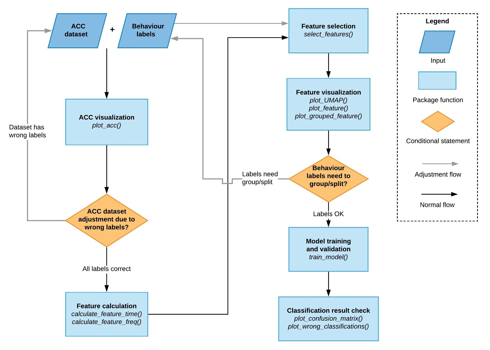

<!-- README.md is generated from README.Rmd. Please edit that file -->

```{r, include = FALSE}
knitr::opts_chunk$set(
  collapse = TRUE,
  comment = "#>",
  fig.path = "man/figures/README-",
  out.width = "100%"
)
```

# rabc

<!-- badges: start -->
[](https://lifecycle.r-lib.org/articles/stages.html#experimental)
[](https://travis-ci.com/YuHuiDeakin/rabc)
[](https://github.com/YuHuiDeakin/rabc/actions)
<!-- badges: end -->

The goal of rabc is to facilitate the development of animal behaviour classification models using accelerometer data.

## Installation

You can install the development version from [GitHub](https://github.com/) with:

``` r
# install.packages("devtools")
devtools::install_github("YuHuiDeakin/rabc", build_vignette = TRUE)
# It will take several minutes to install the package because of vignette building. 
```
## Workflow of the package

Here is the function workflow of the package:




## Example

This is a basic example which shows you how to solve a common problem:

```{r example}
library(rabc)
## basic example code

whitestork_acc_sorted <- order_acc(whitestork_acc)
plot_acc(whitestork_acc_sorted)
```

