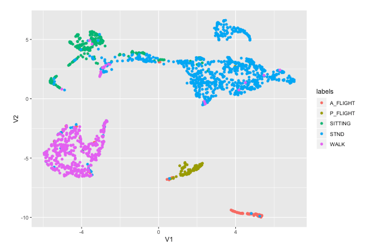
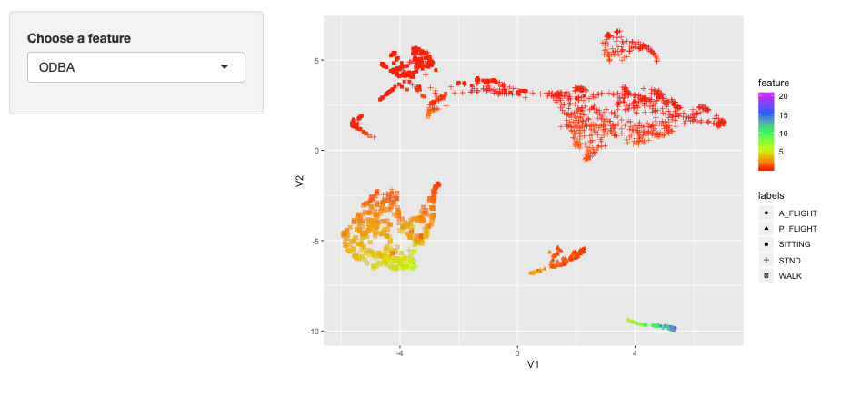
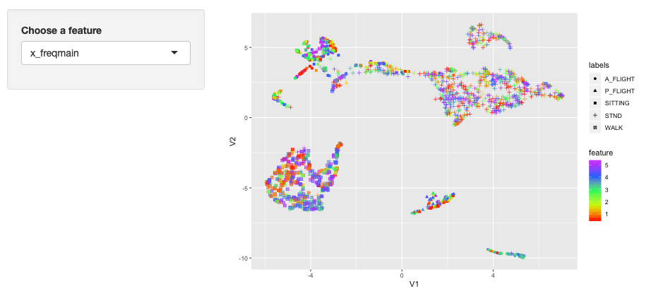
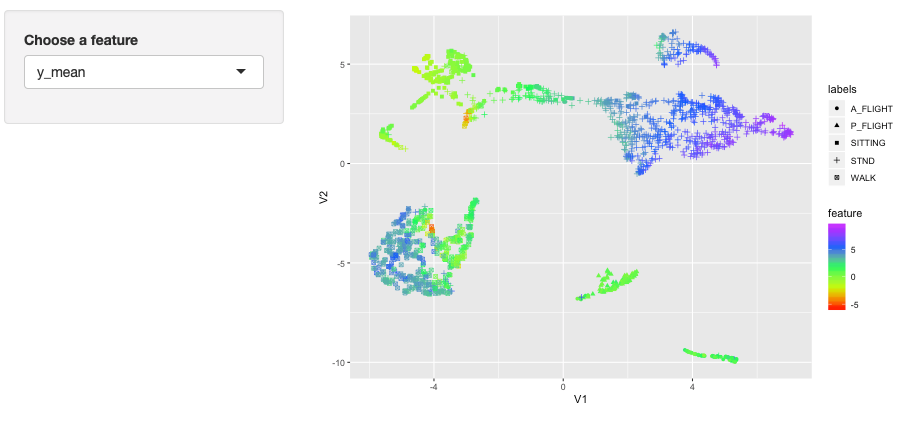
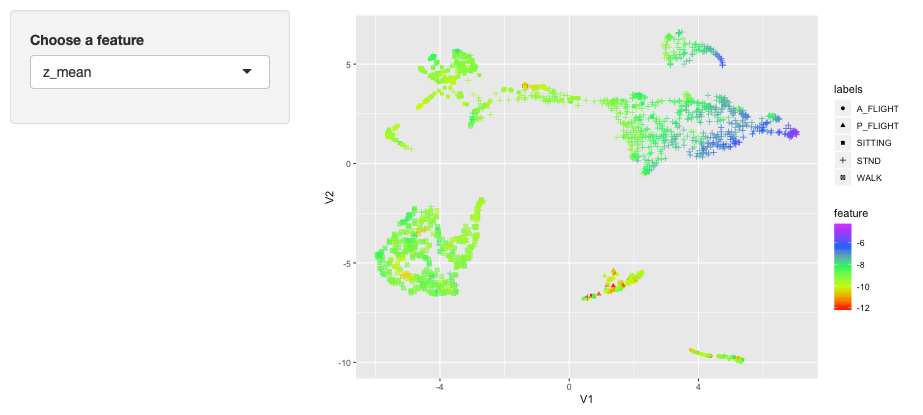
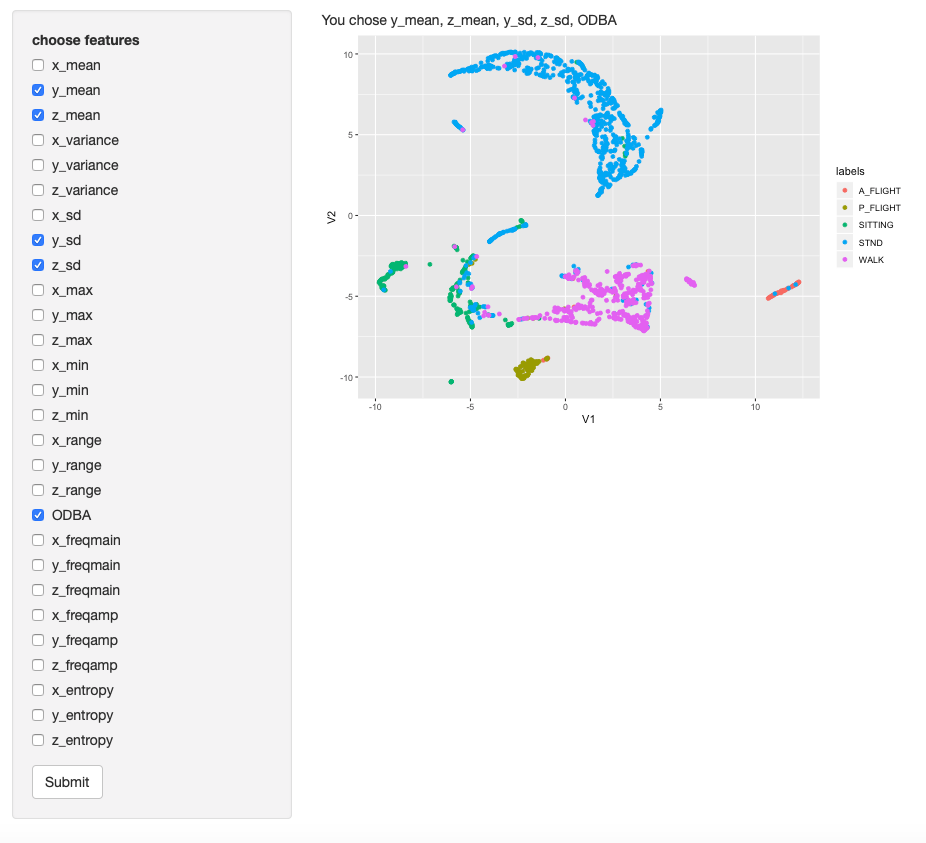
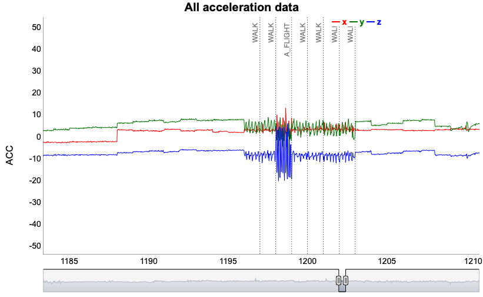

```{r setup, include=FALSE}
knitr::opts_chunk$set(echo = TRUE)
options(shiny.reactlog=TRUE)
```


## Purpose of rabc package

Accelerometers can be used to study animal behaviours. The fundamental goal of this package is to help biologists transform data recorded using accelerometers into behaviours using **XGBoost** as one of the most promising supervised machine learning methods for this purpose (REFERENCE). Unlike the web-based tool "AcceleRater" <http://accapp.move-ecol-minerva.huji.ac.il/>, the rabc package does not focus on providing a "one-stop service" turning raw accelerometer data into behaviours. Rather, the **rabc** package focuses on providing interactive visualization tools to its users to assist in handling and interpreting the accelerometer input data, decide on appropriate behaviour categories, and reduce accelerometer data volume efficiently and effectively (through the calculation and selection of a range of features) without compromising behaviour classification. In brief, this package endeavours to open the lid of the machine-learning "black-box", allowing the integration of your expert knowledge in developing advanced behaviour classification models.

### Ethogram

"Ethogram is a catalogue or inventory of behaviours or actions exhibited by an animal used in ethology" (From wikipedia, and see more info through <https://en.wikipedia.org/wiki/Ethogram>). It's a quantitative description of animal's behaviour and should be objective. An objective ethogram should focusing on describing motor patterns of the target animal(s). And then, the detailed ethogram can be used to form more functional inference of the study species. Usually, ethogram is recorded by researchers from observation. Although there are biases among different people when observing animal behaviours, in theory the ethogram could be in detail even including subtle motions. 


### Animal activities recorded by accelerometer

To understand how accelerometer data could be used to derive animal behaviours, we need to know how accelerometer works. Accelerometer is an electromechanical device used to measure acceleration forces. Such forces may be static, like the continuous force of gravity, or dynamic, sensing changes in movement direction and speed or vibrations. When attached on animals, ACC reflects two important features of movement. First, body postures relative to gravity (i.e. position) could be derived from static components of the ACC signal. Second, after the static component is subtracted from the total acceleration signal, the remainder reflects the dynamic body acceleration, representing the movements of the tagged animal. It's worth mentioning that where the accelerometer is placed on an animal has great conclusiveness on what kind of behaviours can be well derived from ACC data. Let's take dairy cow for example. When the accelerometer is set on one leg of a cow, the data can tell walking behaviour reasonably well because leg movements can be well recorded as the dynamic component of accelerometer. However, the leg-mount accelerometer can hardly tell ruminating behaviour (which is an essential behaviour of a ruminant) of a cow. Rumination includes two stages, cud regurgitation and chewing in mouth. The motions of cud regurgitation and chewing are uncoupled with leg movements and thus can hardly be recorded by a leg-mount accelerometer. Similarly, an ear-mount accelerometer can tell rumination behaviour well but weak at discriminating walking. Therefore, accelerometer has limitations in animal behaviour studies. To maximize functions of accelerometer, one need to have a clear goal of what specific behaviour(s) they what to focus on the target animals and choose body position accordingly (also should consider animal welfare and try to reduce side effect of the tracking device on animals).

Many prior studies tried to do ethogram style behaviour classification from ACC data. In most cases, the tracking devices were put on trunk of animals because most movements are related to trunk. However, some extremity activity can hardly induce trunk movement, such as various hands activities of a primate. Given this, ethogram style behaviour classification from ACC data can hardly matching ethogram from human observation. There were two ways people dealt with this issue. One is to keep all ACC data with corresponding field observation behaviours. Then they train (a) classification model(s) and report performance even though some behaviours have extremely low classification accuracy. Others group some behaviours together and train models based on the grouped dataset. Usually, the second process mode can yield better classification performance. However, people usually group behaviours based on biological or ecological considerations and seldom try to combine the strength of accelerometer (what behaviour group can be best tell from ACC data) with the biological or ecological sound groups. There is a way to get around with this combination - high dimensional data visualization, which I will introduce in the next section.


## Accelerometer data visualization

### Data format

The general workflow to transform accelerometer (ACC) data into behaviours is: (1) the segmentation of raw ACC data into behaviour segments; (2) calculation of features from raw ACC data (see <https://en.wikipedia.org/wiki/Feature_(machine_learning)> for more information); (3) feature selection; and (4) machine-learning animal-behaviour classification model-training and validation. For raw ACC data segmentation, there are two choices: even-length segmentation and variable-length segmentation. Variable-length segmentation requires an algorithm to detect behaviour change points and may thus be prone to error. Even-length segmentation does not require these additional calculations and is therefore much easier to implement. However, even-length ACC segments will inevitably contain behaviour change points (and thus multiple behaviours) affecting down the line processing and behaviour classification. An ACC segment should be sufficiently long to contain enough data to be representative of a behaviour, whereas its length should be limited to avoid inclusion of multiple behaviours as much as possible. In general, large bodied animals have longer durations of one behaviour than small animals. For example, in large herbivores, resting and ruminating behaviours usually last for tens of minutes. In contrast, a small bird might change its behaviour every couple of seconds. Therefore, the segmentation setting should follow activity characteristics of the species under study. Regarding the inevitable segments where behaviour transitions take place, I recommend retaining these segments in the model training. Although these data might decrease the accuracy of the classification model, they will make the model more robust and avoid overestimating model performance. 

This **rabc** package only supports even-length segmentation data. The input data should be a **data.frame** or **tibble** containing raw ACC data including the behaviour associated with the ACC data. For tri-axial ACC data, each row of equal length should be arranged as "x,y,z,x,y,z,...,behaviour", where “behaviour” is the (primary) behaviour observed during that segment  For dual-axial ACC data, it should be arranged as "x,y,x,y,...,behaviour" and for single-axial ACC data as "x,x,...,behaviour"


### Data visualization

For raw data visualization, the rows are first ordered by behaviours but otherwise left in the (time) sequence of how they were arranged in the original data set using the **raw_order** function, which will return a **data.frame** or **tibble** with rearranged rows. For all other functions in the **rabc** package data are expected to be presented in this ordered format.


```{r warning=FALSE}
library(rabc)
data("whitestork_acc")
#The white stork (Ciconia ciconia) tri-axial accelerometer data (reference: <http://accapp.move-ecol-minerva.huji.ac.il/demo/>) was measured at 10.54 Hz. 40 tri-axial measurements, totalling 3.8 seconds, were used to form a segment. The dataset includes 1746  segments each forming a row in the dataset. Each row contains 121 columns. The first 120 columns are accelerometer measurements from three orthogonal axes, arranged as x,y,z,x,y,z,...,x,y,z. The final column is of type character containing the behaviour type. The data set contains 5 different behaviours including "A_FLIGHT" - active flight (77 cases), "P_FLIGHT" - passive filght (96), "WALK" - walking (437), "STND" - standing (863), "SITTING" - resting (273). 
whitestork_acc_sorted <- raw_order(df_raw = whitestork_acc) #sort the data by hebaviour

```

For ACC data visualization, the rabc package uses function **dygraph** (from the dependent package dygraphs) to plot all ACC segments by behaviour. It provides the user a visual impression of how the ACC signal relates to the different behaviours and can also be used for data quality control. The x axis of this graph indicates the row sequence number of the sorted dataset. 

```{r warning=FALSE}
ACC_visual(df_raw = whitestork_acc_sorted, axis_num = 3)
```

Using the range selector under the x-axis you can zoom in.  To illustrate its use, zoom in on the area around segments 60 to 70, which shows that the ACC data in this range are very different from neighbouring segments. Albeit all being labelled as *A_FLIGHT*,  these data resemble *P_FLIGHT* behaviour, warranting their scrutiny and, potentially, their behaviour reclassification. 

This function also allows for single and dual-axis data visualization, as illustrated below where only the ACC x-axis is displayed.

```{r warning=FALSE}
ACC_visual(df_raw = dplyr::bind_cols(whitestork_acc_sorted[, seq(3,121,by = 3)],
                             whitestork_acc_sorted[,121,drop = FALSE]), axis_num = 1)
```

## Feature calculation

The next step is to calculate features from the ACC data. Please see <https://en.wikipedia.org/wiki/Feature_engineering> for the definition of feature engineering or feature extraction. The features will form the input to the machine-learning models. Using functions **feature_time** and **feature_freq**, two basic feature sets are calculated. The first, time-domain feature set, includes: *mean*, *variance*, *standard deviation*, *max*, *min*, *range* and *ODBA*, where *ODBA* is short for Overall Dynamic Body Acceleration. In many studies, this value has been proven to be correlated with the animal’s energy expenditure (see Wilson et al. 2006 <doi:10.1111/j.1365-2656.2006.01127.x> for more details). These features are calculated for each segment and each ACC axis separately (denoted with prefix x, y, z), except for *ODBA*, which is calculated using all available axes. For the *ODBA* calculation a running mean is taken from the raw data of each axis of acceleration within each segment following Shepard et al. (2008 <doi:10.3354/ab00104>). The length of the running mean window is defined by the *winlen_dba* argument.

Note that the feature_time function does not provide an exhaustive list of potential time-domain features. Since it has been asserted that feature engineering can importantly improve the performance of machine-learning models, users may want to consider the calculation of custom features (see Brown et al. 2013 <doi:10.1186/2050-3385-1-20>).


```{r cache=TRUE, warning=FALSE}
df_time <- feature_time(df_raw = whitestork_acc_sorted, winlen_dba = 11)
head(df_time)
summary(df_time)
```

Function **feature_freq** calculates the basic frequency domain features: *main frequency*, *main amplitude* and *frequency entropy*. *Frequency entropy* is a measure of unpredictability of the signal. For example, when an animal is engaging in a rhythmic behaviour, such a stork using active (i.e. flapping) flight, future ACC signals can be predicted from current ACC signals with considerable accuracy. Contrastingly, when an animal is engaging in behaviour with more unpredictable movements, such as foraging in the case of the stork, the entropy value will be higher (see <https://en.wikipedia.org/wiki/Entropy_(information_theory)> for more information). The frequency domain features are calculated for each segment and each ACC axis separately (denoted with prefix x, y, z). Calculations of these features are based on fast fourier transformation of the raw ACC data. In the **feature_freq**  function the required argument *samp_freq* denotes the sampling frequency of the accelerometer in Hz.

It is worth noting that if segment lengths are too short and/or sampling frequency too low the  frequency domain features may have reduced information value, potentially rendering them of limited use for classification model building. 

```{r cache=TRUE, warning=FALSE}
df_freq <- feature_freq(df_raw = whitestork_acc_sorted, samp_freq = 10.54)
head(df_freq)
summary(df_freq)
```

## Visualization of features

The **rabc** package offers three ways to visualize the time and frequency domain features. The first two visualise the features in isolation whereas the third is an integrative approach where entire feature domains are analysed collectively. The first of the visualisation methods, **feature_visual**, draws individual values of features in sequence and the second, **feature_group_plots**, depicts the distribution of all the features by behaviour type. The third, integrative approach uses Uniform Manifold Approximation and Projection (UMAP), which is a nonlinear dimensionality-reduction technique, suitable for high dimensional data visualization.

We will start off with the two methods where features are inspected in isolation. While these visualisations will be exemplified for the time domain features only, these methods can also be used for the frequency domain features. 
 

### Features sequence visualization

Similar to ACC data visualization, function **feature_visual** allows users to generate a visual impression of the feature values by behaviour types, where the x axis of the graph indicates the row sequence number of the sorted dataset. 

Before calling function feature_visual, all behaviours in the sorted ACC dataset need to be drawn together.

```{r cache=TRUE, warning=FALSE}
label_vec <- whitestork_acc_sorted[, ncol(whitestork_acc_sorted)]
#assign behaviour labels to a vector
feature_visual(df_feature = df_time, vec_label = label_vec)
```

The plot containing all time domain features simultaneously can be overwhelming. However, one can also plot a subset of these features. For example:

```{r warning=FALSE}
feature_visual(df_feature = df_time[, grep("mean", names(df_time))], vec_label = label_vec)
```

### Features group visualization

The function **feature_group_plots** generates feature distributions grouped by behaviour types. The distributions can be plotted as density histograms and as boxplots. When one or more features have very dissimilar distributions between behaviours, these feature have great potential to be of value in behaviour classification modelling. Conversely, when features have very similar distributions across behaviours, they can hardly contribute to a behaviour classification model.

```{r fig.width=16, warning=FALSE}
feature_group_plots(df_feature = df_time, vec_label = label_vec, geom = "density")
feature_group_plots(df_feature = df_time, vec_label = label_vec, geom = "boxplot")
```

In many of the density plots we observe clearly different distributions for the various behaviours, (e.g. in *y_mean, y_max, z_max,y_min, Z_min, ODBA*) which make these features potentially good  candidates for behaviour classification modelling. In *x_mean* we oddly observe two peaks in each of the five behaviours. In the white stork dataset, which was collected using backpack accelerometers, x represents the horizontal axis perpendicular to the direction of the spine (i.e. the “sway axis”). The remarkable two-peak distributions in *x_mean* may therefore result from a-central positioning of the accelerometers, some backpacks being positioned slightly to the left of the spine and others slightly to the right. In this case, we should therefore be cautious with including features from the x axis in a behaviour classification model.

The ODBA boxplots suggest clear differentiation of behaviours by *ODBA* with active flight > walking > passive flight > standing > sitting, clearly representing the differences in relative movement intensity of the five behaviours. 


### UMAP high dimensional data visualization

This is a very important part of this package. So I'll use several sections to introduce and illustrate, including ethogram, animal activities recorded by accelerometer, UMAP for high dimensional data visualization and how to combine ethogram and accelerometer data through UMAP.

### UMAP for high dimensional data visualizaion

Uniform manifold approximation and projection (UMAP) is a nonlinear dimensionality-reduction technique. It is also suitable for high dimensional data visualization. One of the core assumptions of UMAP is that there exists manifold structure in the data. UMAP's primary goal is accurately representing local structure. It could also capture more global structure than other techniques (e.g., t-SNE, LargeVis). However, UMAP lacks the strong interpretability of Principal Component Analysis (PCA). The dimensions of the UMAP embedding space have no specific meaning (from original paper of UMAP <https://arxiv.org/pdf/1802.03426.pdf>). 

### Combination of ethogram and accelerometer data through UMAP

With the above mentioned pros and cons, UMAP has found its niches in bioinformatics, materials science and machine learning. However, it has seldom used in animal behaviour studies. As mentioned earlier, the usual way to transform ACC data into behaviours: raw ACC data segmentation into behaviour bouts - calculate raw ACC data into features - (feature selection) - machine learning animal behaviour classification model training and validation. UMAP could be used to transform high dimensional features (usually dozens) into a two-dimension plot. With supervised machine learning, the data points in the two-dimension plot can be plotted with different colors based on different behaviour labels. The optimal scenario is that each behaviour type forms an isolated cluster in this plot. However, in most cases there will exist overlaps. In these cases, researchers can decide which behaviour types to group together and which to keep based on data distributions on UMAP and the biological and ecological meanings. Therefore, UMAP offers a way to combine ethogram and accelerometer data.

There are three panels in this Shiny App, representing three functions. 

* Panel 1: "UMAP calculation and tuning" - see if the behaviour category labels can well represent structure of features.  
This is the core part of this Shiny App to combine ethogram and accelerometer data through UMAP. 
"Features to input" radioButtons give options to users to choose which features groups (i.e., the high dimension dataset) to input into UMAP. In this package, there are in total 28 features from time (19) and frequency (9) domains. Considering UMAP could handle thousands of dimensions, 28 will be effectively processed here. Also, more features might reserve better manifold structure of the data. Therefore, the default is set to include time and frequency domain features. Users can also choose separately from time or frequency domain features to see how well they can preserve structure.  
"Hyperparameter tuning" part gives users tool to tune parameters for UMAP function. "Number of neighbors" (*n_neighbors* in r function umap) controls how UMAP balances local versus global structure in the data. Low value of this parameter force UMAP to focus on very local structure while larger value will let UMAP to depict more global structure. The default setting of n_neighbors is 15. "Minimum distance" (*min_dist*) controls how tightly UMAP is allowed to pack points together. A small min_dist will result in clumpier embeddings. The default setting is 0.1. "Distance metric" (*metric*) determines how distance is computed in the ambient space of input data. The drop-down options include "euclidean", "manhattan", "cosine" and "pearson". The default here is "euclidean". Users can adjust these three parameters to get a good two dimension embedding. Each time one parameter is adjusted, the plot will automatically updated with new parameters (time comsumption depends on observations in the dataset).

Let's see one example with white stork dataset:



From this plot, we can see that in general different behaviours separate well. Only standing (labelled as *STND*) and sitting (*SITTING*) behaviours have some overlap between each other. I'll try to explain why there exists overlap. These two behaviours are all static. Therefore only features representative of static postures can contribute to the differences. Among them, *y_mean* and *z_mean* probably can tell the most difference from distribution plots. However, these two features have small distribution overlaps which will lead to the overlap on UMAP. In reality, the body posture of a white stork has small amount of similar angles during standing or sitting. 

* Panel 2: "Feature visualization through UMAP" - how feature values change on the two dimensional UMAP plot.  
The drop-box let users choose which feature to plot based on the UMAP embedding from panel 1. This function can be explained better through examples.

I chose feature *ODBA* from drop-box first. The color bar with title "feature" represent values of the feature I chose, here *ODBA*. Different behaviour labels are labelled with different shapes. In this plot, we can observe that active flight (*A_FLIGHT*) has distinguishable *ODBA* followed by walking (*WALK*). Therefore, *ODBA* might be a useful feature in classification model. Let's see a negative example:

In this plot, feature *x_freqmain* distribute randomly in each behaviour type. Therefore, it might not provide valuable information in classification model. The following two plots help to show the explanation I gave in panel 1 why sitting and standing have overlap:


We can see from plots of *y_mean* and *z_mean*, the overlap section (V1 between -2 and 2 and V2 ~= 3) have gradual transitions of values, which might cause the overlap in UMAP.

* Panel 3: "Custom features" - see if custom selected features can hold the manifold structure of the data. 
Users can choose which features to input into UMAP from the checkboxes. This function can be used in combination with the results from feature selection function. Here, I choose five features to demenstrate: *y_mean, z_mean, y_sd, z_sd* and *ODBA*

We can see the five features can still preserve the manifold structure of different behaviours.


Notice: to use this shiny app within the package, there should exist variable *df_time* (time domain feature set, a data.frame or tibble), *df_freq* (frequency domain feature set, a data.frame or tibble) and *label_vec* (behaviour labels, a character vector).
```{r echo=FALSE, warning=FALSE}

ui <- navbarPage(
  title = "UMAP visualization",
  tabPanel("UMAP calculation and tuning",
           #sidebarLayout(
             sidebarPanel(
               radioButtons(inputId = "featuretype", label = "Features to input",
                            choices = c("Time and frequency domain" = "TimeFreq",
                                        "Time domain" = "Time",
                                        "Frequency domain" = "Freq"),
                            selected = "TimeFreq"),
               tags$hr(),
               h5("Hyperparameter tuning"),
               sliderInput(inputId = "n_neighbors", label = "Number of neighbours",
                           min = 1, max = 100, value = 15, step = 1),
               sliderInput(inputId = "min_dist", label = "Minimum distance",
                           min = 0, max = 1, value = 0.1, step = 0.05),
               selectInput(inputId = "metric", label = "Distance metric",
                           choices = c("euclidean" = "euclidean",
                                       "manhattan" = "manhattan",
                                       "cosine" = "cosine",
                                       "pearson" = "pearson"),
                           selected = "euclidean")
             ),
           mainPanel(plotOutput("UMAP", height = "auto"))
  ),
  tabPanel("Feature visualization through UMAP",
           sidebarPanel(
             selectInput(inputId = "whichfeature", label = "Choose a feature",
                         choices = c("x_mean" = "x_mean",
                                     "y_mean" = "y_mean",
                                     "z_mean" = "z_mean",
                                     "x_variance" = "x_variance",
                                     "y_variance" = "y_variance",
                                     "z_variance" = "z_variance",
                                     "x_sd" = "x_sd",
                                     "y_sd" = "y_sd",
                                     "z_sd" = "z_sd",
                                     "x_max" = "x_max",
                                     "y_max" = "y_max",
                                     "z_max" = "z_max",
                                     "x_min" = "x_min",
                                     "y_min" = "y_min",
                                     "z_min" = "z_min",
                                     "x_range" = "x_range",
                                     "y_range" = "y_range",
                                     "z_range" = "z_range",
                                     "ODBA" = "ODBA",
                                     "x_freqmain" = "x_freqmain",
                                     "y_freqmain" = "y_freqmain",
                                     "z_freqmain" = "z_freqmain",
                                     "x_freqamp" = "x_freqamp",
                                     "y_freqamp" = "y_freqamp",
                                     "z_freqamp" = "z_freqamp",
                                     "x_entropy" = "x_entropy",
                                     "y_entropy" = "y_entropy",
                                     "z_entropy" = "z_entropy"),
                         selected = "x_mean")
           ),
           mainPanel(plotOutput("UMAP_feature", height = "auto"))
  ),
  tabPanel("Custom features",
           sidebarPanel(
             checkboxGroupInput(inputId = "customfeatures",
                                label = "choose features",
                                choices = c("x_mean" = "x_mean",
                                            "y_mean" = "y_mean",
                                            "z_mean" = "z_mean",
                                            "x_variance" = "x_variance",
                                            "y_variance" = "y_variance",
                                            "z_variance" = "z_variance",
                                            "x_sd" = "x_sd",
                                            "y_sd" = "y_sd",
                                            "z_sd" = "z_sd",
                                            "x_max" = "x_max",
                                            "y_max" = "y_max",
                                            "z_max" = "z_max",
                                            "x_min" = "x_min",
                                            "y_min" = "y_min",
                                            "z_min" = "z_min",
                                            "x_range" = "x_range",
                                            "y_range" = "y_range",
                                            "z_range" = "z_range",
                                            "ODBA" = "ODBA",
                                            "x_freqmain" = "x_freqmain",
                                            "y_freqmain" = "y_freqmain",
                                            "z_freqmain" = "z_freqmain",
                                            "x_freqamp" = "x_freqamp",
                                            "y_freqamp" = "y_freqamp",
                                            "z_freqamp" = "z_freqamp",
                                            "x_entropy" = "x_entropy",
                                            "y_entropy" = "y_entropy",
                                            "z_entropy" = "z_entropy")),
             actionButton(inputId = "gogogo", label = "Submit")
           ),
           mainPanel(
             textOutput("txt"),
             plotOutput("UMAP_custom", height = "auto")
           )
  )
)


server <- function (input, output, session) {
  paras1 <- reactive({
    as.double(input$n_neighbors)
  })
  paras2 <- reactive({
    as.double(input$min_dist)
  })
  paras3 <- reactive({
    as.character(input$metric)
  })

  para_feature <- reactive({
    input$whichfeature
  })


  output$UMAP <- renderPlot({

    if (input$featuretype == "TimeFreq") {
      df_out <<- dplyr::bind_cols(df_time, df_freq, data.frame(label_vec))
    } else if (input$featuretype == "Time") {
      df_out <- dplyr::bind_cols(df_time, data.frame(label_vec))
    } else if (input$featuretype == "Freq") {
      df_out <- dplyr::bind_cols(df_freq, data.frame(label_vec))
    }

    umap_out <- umap::umap(as.matrix(df_out[,-dim(df_out)[2]]), n_neighbors = paras1(),
                     min_dist = paras2(), metric = paras3())
    umap_df <<- dplyr::bind_cols(as.data.frame(umap_out$layout), labels = df_out$label_vec)

    ggplot2::ggplot(umap_df, aes(x = V1, y = V2, color = labels)) +
      ggplot2::geom_point(alpha = 0.8) +
      ggplot2::scale_color_brewer(palette = "Set1")
  }, height = function(){
    session$clientData$output_UMAP_width * 0.8
  })

  output$UMAP_feature <- renderPlot({
    umap_df1 <- dplyr::bind_cols(umap_df, feature = df_out[,para_feature()])
    ggplot2::ggplot(umap_df1, aes(x = V1, y = V2, color = feature,
                         shape = labels)) +
      ggplot2::geom_point() +
      ggplot2::scale_color_gradientn(colours = rainbow(5))
  }, height = function(){
    session$clientData$output_UMAP_feature_width * 0.8
  })

  output$txt <- renderText({
    features <- paste(input$customfeatures, collapse = ", ")
    customfeatures <<- input$customfeatures
    paste("You chose", features)
  })

  observeEvent(input$gogogo, {
    #req(input$customfeatures)
    output$UMAP_custom <- renderPlot({
      umap_new <- umap::umap(as.matrix(df_out[,customfeatures]), metric = "manhattan")
      umap_newdf <- dplyr::bind_cols(as.data.frame(umap_new$layout),
                              labels = df_out$label_vec)
      ggplot2::ggplot(umap_newdf, aes(x = V1, y = V2, color = labels)) +
        ggplot2::geom_point(alpha = 0.8) +
        ggplot2::scale_color_brewer(palette = "Set1")
    }, height = function(){
      session$clientData$output_UMAP_custom_width * 0.8
    })
  })
}

shinyApp(ui, server)
```

## Feature selection

"In machine learning, feature selection is the process of selecting a subset of relevant features (variables, predictors) for use in model construction" (from wikipedia, for more information <https://en.wikipedia.org/wiki/Feature_selection>). In animal behaviour studies using accelerometer, there were usually tens of features used in model construction. Although this number of features is a relative small number compared to many other machine learning models, there still exists redundant and irrelevant features. Redundant features are those which have high correlation with some other features and have similar contribution in model construction. And irrelevant features could hardly contribute to model construction, like the above example - *x_freqmain* feature in UMAP plot. There are three outcomes from feature selection. First, less features will make the model easier to interpret. Researchers might find biomechanical connection between features and the classification model. Second, the simplified feature set has potential to be calculated on-board of trackers. Third, as in many cases the behaviour classification model is used for prediction, less features have potential to enhance generalization by reducing overfitting. 

In this package, a combination of filter and wrapper feature selection method is used. The filter method uses correlation coefficients between features. The absolute values of pair-wise correlations are considerd. If two variables have a high correlation, the function looks at the mean absolute correlation of each variable and removes the variable with the largest mean absolute correaltion. The threshold of correlation coefficient is defined by user with default *cutoff = 0.9*. The filter part has the purpose to reduce redundancy of features. The wrapper part uses stepwise forward selection (SFS) with a wrapper XGBoost. The number of features to select depends on user choice with default *no_features = 5*. This parameter also determines how many rounds of SFS. In the first round, each feature is individually used to train a classification model by XGBoost. The feature with highest overall accuracy will be kept into the selected feature set. Then in every following round, each remaining feature will be combined with the selected feature set to train a classification model and the one with highest accuracy will be kept into the selected feature set. The process will stop until number of rounds equals to no_features. The purpose of the wrapper is to reduce number of irrelevant features. 

User has option to decide whether to use the filter function by setting parameter *filter* and the default is "FALSE" - not use the filter function (the total number of time and frequency domain features is 28 and this number is not a burden to the wrapper function). 

The function will return a list. list[[1]] contains a matrix. Columns are named by all the features. Each row records classification accuracy of corresponding feature. Once a feature is selected into the selected feature set, the rest rows of this feature will be labelled zero. list[[2]] contains names of selected features with the order of selection. The classification accuracy of each round can be plotted with function plot_tune.

```{r warning=FALSE}

results <- filter_wrapper(df_feature = cbind(df_time, df_freq),
                          vec_label = label_vec, filter = FALSE,
                          no_features = 10)
results[[1]]
results[[2]]
plot_tune(results = results)
```
We can see that after the sixth selected feature *z_variance*, there is almost no improvements of accuracy when selecting more features.

## Classification model 

Usually, supervised machine learning classification model building and evaluation includes several steps: model hyperparameter tuning by cross-validation, model training with optimal parameter set, model performance evaluation with a testing dataset. One R package **caret** contains functions to streamline the model building and evaluation process. And the short introduction of this package gives concise and clear explanations with an example <https://cran.r-project.org/web/packages/caret/vignettes/caret.html>.

In this package, extreme gradient boosting (XGBoost) is used for behaviour classification given its good performance in Kaggle machine learning competitions. **XGBoost** is a scalable tree boosting method which proved to be better than other tree boosting methods and random forest. We also figured out this model is fast to train and has good performace with small number of trees for animal behaviour classification tasks from previous research.

User can choose which features to use for model buiding through parameter "df". Parameter hyper_choice has two options: "defaults" will let XGBoost use its default hyperparameters while "tune" will let the function to run repeated cross-validation to find a best parameter set (the choices of parameters: *nrounds = 10, max_depth = c(2, 3, 4, 5, 6), eta = c(0.01, 0.1, 0.2, 0.3), gamma = c(0, 0.1, 0.5), colsample_bytree = 1, min_child_weight = 1, subsample = 1*). Parameter train_ratio determines percentage of data used to train the model and the rest data will be used to test the model and give performace report. The function will also give feature contribution score evaluated by the model XGBoost to the console.

```{r warning=FALSE}
train_model(df_time[, results$features[1:6]], vec_label = label_vec)
```

### Result confusion table plot
In this function, input dataset will be randomly partitioned into 5 folds without replacement according to levels of behaviour labels (see function createFolds in "caret" for more details). Each fold of the 5 folds will be used as a test set while the rest data used as the training set. The classification model used in this function is XGBoost. Parameters of the XGBoost model are set like the following: *n_rounds = 10, max_depth = 6, eta = 0.3, gamma = 0, colsample_bytree = 1, min_child_weight = 1, subsample = 1*. After each training and testing round of the 5 rounds, all original behaviour labels (observation) and predicted behaviours will be recorded. In the confusion table plot, x axis "obs" denotes observations and y axis "pre" denotes predictions. Dots are colored according to classification results. The annotated numbers are number of cases in each observation and prediction group.

```{r}
pred <- result_check(df = df_time, vec_label = label_vec)
head(pred)
```

### Wrong prediction plot on ACC_visual
The base dygraph is the same with plot by function **ACC_visual**. All wrong predictions in the data.frame from function result_check are denoted with dotted line annotated with the predicted behaviour label on top. Through this plot, user can inspect each individual wrong prediction by classification model and understand why some of the misclassifications occur.

Here is the function to show all misclassification cases:
```{r warning=FALSE}
result_visual(whitestork_acc_sorted, df_result = pred)
```


Among the standing behaviour bouts, the above denoted dotted lines are misclassifications. Compared with other standing bouts, the misclassifications have more dynamic movements. This might due to the individual flapped wings when standing.

