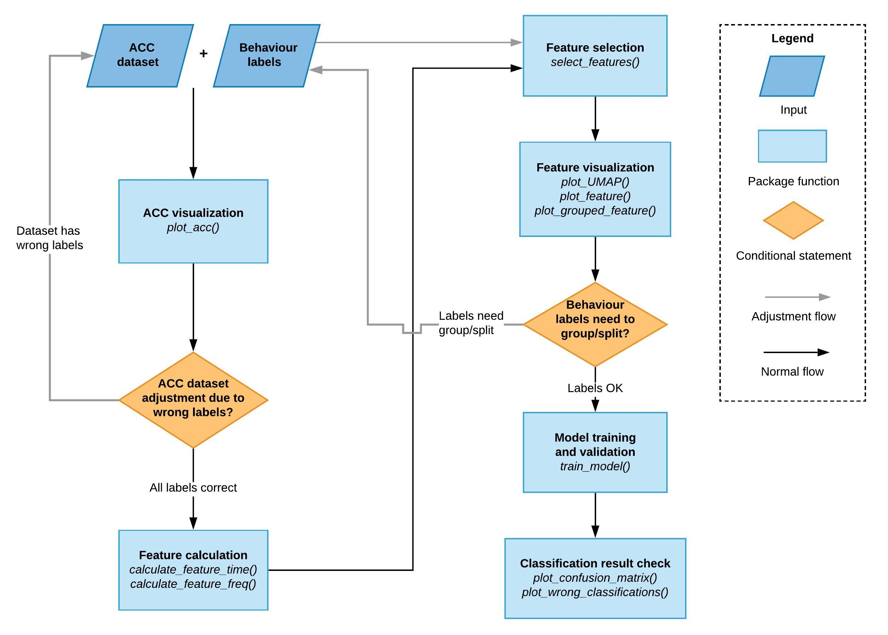

```{r, include = FALSE}
knitr::opts_chunk$set(
  collapse = TRUE,
  comment = "#>"
)
```

```{r setup}
library(rabc)
```

## Purpose of rabc package

Accelerometer (ACC) can be used to study animal behaviours. The fundamental goal of this package is to help biologists transform data recorded using accelerometers into behaviours using **XGBoost** as one of the most promising supervised machine learning methods for this purpose (refer to < https://arxiv.org/abs/1603.02754>). Unlike the web-based tool "AcceleRater" <http://accapp.move-ecol-minerva.huji.ac.il/>, the rabc package does not focus on providing a "one-stop service" turning raw accelerometer data into behaviours. Rather, the **rabc** package focuses on providing interactive visualization tools to its users to assist in handling and interpreting the accelerometer input data, decide on appropriate behaviour categories, and reduce accelerometer data volume efficiently and effectively (through the calculation and selection of a range of features, for definition of “feature” in machine learning, refer to <https://en.wikipedia.org/wiki/Feature_engineering>) without compromising behaviour classification. In brief, this package endeavours to open the lid of the machine-learning "black-box", allowing the integration of your expert knowledge in developing advanced behaviour classification models.

### Animal activities recorded by accelerometer

To understand how ACC data could be used to derive animal behaviours, we need to know how ACCs work. An ACC is an electromechanical device used to measure acceleration forces. Such forces may be static, like the continuous force of gravity, or dynamic, sensing changes in movement direction and speed or vibrations. When attached on animals, ACCs reflect two important features of movement. First, body posture relative to gravity (i.e. position) can be derived from static components of the ACC signal. Second, after the static component is subtracted from the total ACC signal, the remainder reflects the dynamic body acceleration, representing the movements of the ACC-equipped animal. It's worth mentioning that where the ACC is placed on an animal has great impact on what kind of behaviours can be derived from ACC data. Let's take dairy cow for example. When the ACC is set on a leg of a cow, the data can inform on walking behaviour reasonably well, because leg movements can be well recorded as the dynamic component of ACC. However, the leg-mount ACC can hardly tell ruminating behaviour (which is obviously an essential behaviour in a ruminant, such as a cow). Rumination includes two stages, cud regurgitation and chewing in the mouth. The motions of cud regurgitation and chewing are uncoupled with leg movements and thus can hardly be recorded by a leg-mount ACC. Similarly, an ear-mount ACC can tell rumination behaviour well but is weak at discriminating walking. Therefore, it is important to consider the exact placement of the ACC device in relation to the specific behaviour(s) one wants to study.

Many studies have already conducted behaviour classification from ACC data. In most cases, ACC data with corresponding behavioural field observations are used to train behaviour classification models and report performance. In some cases, specific behaviours in such studies may yield (very) low classification accuracy. Using fewer behaviour classes and aggregating similar behaviours usually yield better classification performance. However, this grouping of behaviours is typically based on biological or ecological considerations and may not always consider the capability of ACC data to discriminate between behaviours. This package, with high dimensional data visualization at its core, endeavours to assist with such an integrative process.

## Accelerometer data visualization

### Data format

The general workflow to transform ACC data into behaviours is: (1) the segmentation of raw ACC data into behaviour segments; (2) calculation of features from raw ACC data; (3) feature selection (including feature visualisation); and (4) machine-learning animal-behaviour classification model-training and validation (Fig.1). The rabc package has associated visualisation steps in this workflow to facilitate the process. 

```{r rabc_diagram, echo = FALSE,fig.align='center', out.width="90%", fig.cap="Figure 1. The general workflow to transform ACC data into behaviours with associated rabc data visualisation steps to facilitate the process."}

```

For raw ACC data segmentation, there are two choices: even-length segmentation and variable-length segmentation. Variable-length segmentation requires an algorithm to detect behaviour change points and may thus be prone to error. Even-length segmentation does not require these additional calculations and is therefore much easier to implement. However, even-length ACC segments will inevitably contain behaviour change points (and thus multiple behaviours) affecting down the line processing and behaviour classification. An ACC segment should be sufficiently long to contain enough data to be representative of a behaviour, whereas its length should be limited to avoid inclusion of multiple behaviours as much as possible. In general, large bodied animals have longer durations of one behaviour than small animals. For example, in large herbivores, resting and ruminating behaviours usually last for tens of minutes. In contrast, a small bird might change its behaviour every couple of seconds. Therefore, the segmentation setting should follow activity characteristics of the species under study. Regarding the inevitable segments where behaviour transitions take place, I recommend retaining these segments in the model training. Although these data might decrease the accuracy of the classification model, they will make the model more robust and avoid overestimating model performance. 

This **rabc** package only supports even-length segmentation data. The input data should be a **data.frame** or **tibble** containing raw ACC data including the behaviour associated with the ACC data. For tri-axial ACC data, each row of equal length should be arranged as "x,y,z,x,y,z,...,behaviour", where “behaviour” is the (primary) behaviour observed during that segment  For dual-axial ACC data, it should be arranged as "x,y,x,y,...,behaviour" and for single-axial ACC data as "x,x,...,behaviour"

### ACC visualization

Visualising the raw ACC data provides the user a convenient impression of how the ACC signal relates to the different behaviours and can also be used for data quality control. For raw ACC visualization, the rows are first ordered by behaviours but otherwise left in the (time) sequence of how they were arranged in the original data set using the **order_acc** function, which will return a **data.frame** or **tibble** with rearranged rows. For all other functions in the **rabc** package data are expected to be presented in this ordered format.


```{r warning=FALSE}
data("whitestork_acc")
#The white stork (Ciconia ciconia) tri-axial accelerometer data (reference: #<http://accapp.move-ecol-minerva.huji.ac.il/demo/>) was measured at 10.54 Hz. 40 tri-axial #measurements, totalling 3.8 seconds, were used to form a segment. The dataset includes 1746  #segments each forming a row in the dataset. Each row contains 121 columns. The first 120 columns are #accelerometer measurements from three orthogonal axes, arranged as x,y,z,x,y,z,...,x,y,z. The final #column is of type character containing the behaviour type. The data set contains 5 different #behaviours including "A_FLIGHT" - active flight (77 cases), "P_FLIGHT" - passive filght (96), "WALK" #- walking (437), "STND" - standing (863), "SITTING" - resting (273). 
whitestork_acc_sorted <- order_acc(df_raw = whitestork_acc) #sort the data by hebaviour
```

For ACC data visualization, the **rabc** package uses function **dygraph** (from the dependent package dygraphs) to plot all ACC segments by behaviour. The x axis of this graph indicates the row sequence number of the sorted dataset. 

```{r warning=FALSE, fig.align='center', out.width="90%", fig.cap="Figure 2. Dynamic graph of tri-axial ACC data."}
plot_acc(df_raw = whitestork_acc_sorted, axis_num = 3)
```

Using the range selector under the x-axis you can zoom in.  To illustrate its use, zoom in on the area around segments 60 to 70, which shows that the ACC data in this range are very different from neighbouring segments. Albeit all being labelled as *A_FLIGHT*,  these data resemble *P_FLIGHT* behaviour, warranting their scrutiny and, potentially, their behaviour reclassification. 

This function also allows for single and dual-axis data visualization, as illustrated below where only the ACC x-axis is displayed.

```{r warning=FALSE, fig.align='center', out.width="90%", fig.cap="Figure 3. Dynamic graph of single-axial ACC data."}
plot_acc(df_raw = dplyr::bind_cols(whitestork_acc_sorted[, seq(3,121,by = 3)],
                             whitestork_acc_sorted[,121,drop = FALSE]), axis_num = 1)
```

In some cases, the accelerometer data are not organized as the data format required by **rabc** package. Here is an example to transform a dummy data frame into the **rabc** data format and display.

```{r echo=TRUE, warning=FALSE, fig.align='center', out.width="90%", fig.cap="Figure 4. Dynamic graph of dummy ACC data."}
library(lubridate)

time_start <- ymd_hms("2021-04-20 12:00:00")
timestamp <- seq(time_start, time_start + 30 - 0.1, by = 0.1)

acc_x <- c(rep(0, 100), 0.2*sin(seq(0, 32*pi, length.out=100)) + rnorm(100, 0, 0.03), 0.5*sin(seq(0, 32*pi, length.out=100) + 0.3) + rnorm(100, 0, 0.05))
acc_y <- c(rep(0, 100), 0.1*cos(seq(0, 32*pi, length.out=100)) + rnorm(100, 0, 0.03), 0.25*cos(seq(0, 32*pi, length.out=100) + 0.3) + rnorm(100, 0, 0.05))
acc_z <- c(rep(-1, 100), 0.3*sin(seq(0, 32*pi, length.out=100)) + rnorm(100, 0, 0.03) - 1, 0.7*sin(seq(0, 32*pi, length.out=100) + 0.3) + rnorm(100, 0, 0.05) - 1)

label <- c(rep("rest", 100), rep("walk", 100), rep("fly", 100))

dummy_acc_df <- data.frame(timestamp, acc_x, acc_y, acc_z, label)
#assume the dummy data have 10 Hz sampling rate, each even length behaviour segment last for 1 second, i.e. 10 rows in the dummy data frame for one behaviour segment. The behaviour labels of dummy_acc_df are annotated  for each row.

#the dummy data frame need to be transformed for its use in rabc package
segment_len <- 10

mat_acc <- matrix(0, nrow = nrow(dummy_acc_df)/segment_len, ncol = segment_len*3)
for (i in 1:(nrow(dummy_acc_df)/segment_len)) {
  mat_acc[i, seq(1, ncol(mat_acc), 3)] <- dummy_acc_df$acc_x[((i - 1) * segment_len + 1):(i*segment_len)]
  mat_acc[i, seq(2, ncol(mat_acc), 3)] <- dummy_acc_df$acc_y[((i - 1) * segment_len + 1):(i*segment_len)]
  mat_acc[i, seq(3, ncol(mat_acc), 3)] <- dummy_acc_df$acc_z[((i - 1) * segment_len + 1):(i*segment_len)]
}

dummy_acc_rabc <- as.data.frame(mat_acc)
dummy_acc_rabc$label <- dummy_acc_df$label[seq(1, nrow(dummy_acc_df), by = segment_len)]

#now dummy_acc_rabc is organized as rabc package format, it can be sorted and plotted
dummy_acc_rabc_sorted <- order_acc(dummy_acc_rabc)
plot_acc(dummy_acc_rabc_sorted)
```

## Feature calculation

The next step is to calculate features from the ACC data. The features will form the input to the machine-learning models. Using functions **calculate_feature_time** and **calculate_feature_freq**, two basic feature sets are calculated. The first, time-domain feature set, includes: *mean*, *variance*, *standard deviation*, *max*, *min*, *range* and *ODBA*, where *ODBA* is short for Overall Dynamic Body Acceleration. In many studies, this value has been proven to be correlated with the animal’s energy expenditure (see Wilson et al. 2006 <doi:10.1111/j.1365-2656.2006.01127.x> for more details). These features are calculated for each segment and each ACC axis separately (denoted with prefix x, y, z), except for *ODBA*, which is calculated using all available axes. For the *ODBA* calculation a running mean is taken from the raw data of each axis of acceleration within each segment following Shepard et al. (2008 <doi:10.3354/ab00104>). The length of the running mean window is defined by the *winlen_dba* argument.

Note that the feature_time function does not provide an exhaustive list of potential time-domain features (for more features see Brown et al. 2013 <doi:10.1186/2050-3385-1-20). Since it has been asserted that feature engineering can importantly improve the performance of machine-learning models, users may want to consider the calculation of custom features. All the functions in this package which work on feature **data.frame** or **tibble** defined by function **calculate_feature_time** and **calculate_feature_freq** are able to work also with custom features. Users need to use function **cbind** or **bind_cols** (dplyr package) for combination of feature groups.


```{r cache=TRUE, warning=FALSE}
df_time <- calculate_feature_time(df_raw = whitestork_acc_sorted, winlen_dba = 11)
head(df_time, n = 2)
```

Function **calculate_feature_freq** calculates the basic frequency domain features: *main frequency*, *main amplitude* and *frequency entropy*. *Frequency entropy* is a measure of unpredictability of the signal. For example, when an animal is engaging in a rhythmic behaviour, such a stork using active (i.e. flapping) flight, future ACC signals can be predicted from current ACC signals with considerable accuracy. Contrastingly, when an animal is engaging in behaviour with more unpredictable movements, such as foraging in the case of the stork, the entropy value will be higher (see <https://en.wikipedia.org/wiki/Entropy_(information_theory)> for more information). As for the time-domain features, also the frequency-domain features are calculated for each segment and each ACC axis separately (denoted with prefix x, y, z). Calculations of these features are based on fast fourier transformation of the raw ACC data. In the **calculate_feature_freq**  function the required argument *samp_freq* denotes the sampling frequency of the ACC in Hz.

It is worth noting that if segment lengths are too short and/or sampling frequency too low the  frequency domain features may have reduced information value, potentially rendering them of limited use for classification model building. 

```{r cache=TRUE, warning=FALSE}
df_freq <- calculate_feature_freq(df_raw = whitestork_acc_sorted, samp_freq = 10.54)
head(df_freq, n = 2)
```

There are 28 features calculated by functions **calculate_feature_time** and **calculate_feature_freq**. Users can develop additional features if deemed necessary. Here is an example to calculate additional features with the data *whitestork_acc_sorted*.

```{r cache=TRUE, warning=FALSE}
#divide the dataset into subsets 
col_num <- ncol(whitestork_acc_sorted) 
sub_x <- whitestork_acc_sorted[, seq(from = 1, to = col_num - 1, by = 3)]
sub_y <- whitestork_acc_sorted[, seq(from = 2, to = col_num - 1, by = 3)]
sub_z <- whitestork_acc_sorted[, seq(from = 3, to = col_num - 1, by = 3)]

#transform data.frame into matrix
matsub_x <- as.matrix(sub_x)
matsub_y <- as.matrix(sub_y)
matsub_z <- as.matrix(sub_z)

#for skewness calculation
library(e1071)

skew_x <- apply(matsub_x, 1, skewness)
skew_y <- apply(matsub_y, 1, skewness)
skew_z <- apply(matsub_z, 1, skewness)

#calculate pearson correlation among axes
cor_xy <- sapply(1:nrow(whitestork_acc_sorted), function(i) cor(matsub_x[i,], matsub_y[i,]))
cor_yz <- sapply(1:nrow(whitestork_acc_sorted), function(i) cor(matsub_y[i,], matsub_z[i,]))
cor_xz <- sapply(1:nrow(whitestork_acc_sorted), function(i) cor(matsub_x[i,], matsub_z[i,]))

df_custom <- data.frame(skew_x, skew_y, skew_z,
                        cor_xy, cor_yz, cor_xz)

head(df_custom)
```
## Feature selection

Feature selection is the process of selecting a subset of relevant features (variables, predictors) for use in model construction (<https://en.wikipedia.org/wiki/Feature_selection>). In animal behaviour studies using ACC, typically tens of features are being used in model construction. Although a relatively small number, compared to many other machine-learning models, there may still be redundancy in this feature set. Redundant features are features that show high correlation with other features and similarly contribute to model construction. Redundant features can also be “irrelevant” features that hardly contribute to model construction. There are three aims with feature selection. Firstly, less features will make the model easier to interpret. Researchers might, for instance, more easily find biomechanical connections between features and the ultimate classification model. Secondly, as in many cases the behaviour classification model is used for prediction, less features have more potential to enhance generalizations by reducing overfitting. Thirdly and finally, because of lower computational requirements in assessing behaviour from ACC data, reduced feature sets have greater potential to be used in ACC devices themselves, e.g. on-board of light-weight tracking devices. 

In the **rabc** package, a combination of a filter and a wrapper feature selection method is used by function **select_features**. The filter part has the purpose of removing redundant features. The filtering method uses the absolute values of pair-wise correlation coefficients between features. If two variables have a high correlation, the function looks at the mean absolute correlation of each variable and removes the variable with the largest mean absolute correlation. The threshold correlation coefficient (*cutoff*) is user-defined with a default "*cutoff = 0.9*". In the default constellation the filter function is turned off (i.e. "*filter = FALSE*").

The purpose of the wrapper is to select most relevant features. The wrapper part uses stepwise forward selection (SFS) using extreme gradient boosting (XGBoost), which is not only used for feature selection but also for the final classification model (see below). XGBoost is a scalable tree boosting method that proved to be better than other tree boosting methods and random forest, showing very good performance in Kaggle machine learning competitions. We also experienced ourselves that XGBoost is fast to train and has good performance with limited numbers of trees, which typically applies to animal behaviour classification tasks. The number of features to select (*no_features*) can be set by the user, having a default of "*no_features = 5*". This parameter also determines how many rounds of SFS are being conducted. In the first round, each feature is individually used to train a classification model by XGBoost. The feature with highest overall accuracy will be kept into the selected feature set. Then, in every following round, each remaining feature will be combined with the selected feature set to train a classification model and the one with the highest accuracy will be kept into the selected feature set. The process will stop when the number of rounds equals the no_features setting. 

The **select_features** function will return a list of which the first member (i.e., [[1]]) contains a matrix providing the classification accuracy for each of the features (columns) across all steps (rows, top row being first step) of the SFS process. Once a feature is selected into the selected feature set, the remaining values in this feature’s column are set to zero. The second member of the list (i.e., [[2]]) contains the names of the selected features in the order in which they were selected in the SFS process. The development of the classification accuracy with each step in the SFS process is plotted with function **plot_selection_accuracy**. In addition, **select_features** function can also work with custom calculated features.

```{r cache=TRUE, warning=FALSE, fig.align='center', out.width="100%", fig.cap="Figure 5. The accuracy plot of selected features. Line and dots in the plot denotes classification accuracies of accumulated selected features. Grey bars indicate accuracy increase (labeled with numbers) of each selected feature."}
label_vec <- whitestork_acc_sorted$V121
selection <- select_features(df_feature = cbind(df_time, df_freq), 
                            vec_label = label_vec, filter = FALSE,
                            no_features = 10)
# the custom features can also be used in select_features function by replacing the argument df_feature = dplyr::bind_cols(df_time, df_freq, df_custom)
selection[[1]] 
selection[[2]]
plot_selection_accuracy(results = selection)
```

We can see that after the sixth selected feature, "z_mean", there is almost no further improvement in classification accuracy with the addition of more features. Users can define the cut-off point when there is no improvement of accuracy or the improvement of accuracy is less than a certain threshold.

## Visualization of features to evaluate behaviour sets

Above, under “features selection” we already mentioned the three objectives with feature selection: improving interpretability, reducing overfitting, reducing computational requirements. Visualisation of the features can further assist in deciding on the features to use in the ultimate behaviour classification model, but its main use is in deciding if any behaviour types should be combined to ultimately improve behaviour classification performance. Alternatively, the visualisation may also lead to considering splitting up existing behaviour types into multiple behaviours. In other words this visualisation aids in evaluating the behaviour set.

The **rabc** package offers three ways to visualize the time and frequency domain features. The first two visualise the features in isolation whereas the third is an integrative approach where entire feature domains are analysed collectively. The first of the visualisation methods, **plot_feature**, draws individual values of features in sequence and the second, **plot_grouped_feature**, depicts the distribution of all the features by behaviour type. The third, integrative approach uses Uniform Manifold Approximation and Projection (UMAP), which is a nonlinear dimensionality-reduction technique, suitable for high dimensional data visualization.

We will start off with the two methods where features are inspected in isolation. While these visualisations will be exemplified for the time domain features only, these methods can also be used for the frequency domain features. 

### Features sequence visualization

Similar to ACC data visualization, function **plot_feature** allows users to generate a visual impression of the feature values by behaviour types, where the x axis of the graph indicates the row sequence number of the sorted dataset. This function can also work with custom calculated features. 

```{r cache=TRUE, warning=FALSE, fig.align="center", out.width="90%", fig.cap="Figure 6. Mean values of three axes sequence plot."}

plot_feature(df_feature = df_time[, grep("mean", names(df_time))], vec_label = label_vec)

#plot custom calculated features
#plot_feature(df_feature  = df_custom, vec_label = label_vec)
```

### Features group visualization

The function **plot_grouped_feature** generates feature distributions grouped by behaviour types. The distributions can be plotted as density plots and as boxplots (also violin plots). When one or more features have very dissimilar distributions between behaviours, these features have great potential to be of value in behaviour classification modelling. Conversely, when features have very similar distributions across behaviours, they can hardly contribute to a behaviour classification model.This function can also work with custom calculated features.

```{r warning=FALSE, fig.align="center", out.width="100%", fig.cap="Figure 7. Density plots of 9 time domain features."}
plot_grouped_feature(df_feature = df_time[, c(1:2, 10:15, 19)], vec_label = label_vec, geom = "density")

#plot grouped custom calculated features
#plot_grouped_feature(df_feature = df_custom, vec_label = label_vec, geom = "violin")
```

```{r warning=FALSE, fig.align="center", out.width="100%", fig.cap="Figure 8. Boxplots of 9 time domain features."}
plot_grouped_feature(df_feature = df_time[, c(1:2, 10:15, 19)], vec_label = label_vec, geom = "boxplot")
```

In many of the density plots we observe clearly different distributions for the various behaviours, (e.g. in *y_mean, y_max, z_max,y_min, Z_min, ODBA*) which make these features potentially good  candidates for behaviour classification modelling. In *x_mean* we oddly observe two peaks in each of the five behaviours. In the white stork dataset, which was collected using backpack ACCs, x represents the horizontal axis perpendicular to the direction of the spine (i.e. the “sway axis”). The remarkable two-peak distributions in *x_mean* may therefore result from a-central positioning of the ACCs, some backpacks being positioned slightly to the left of the spine and others slightly to the right. In this case, we should therefore be cautious with including features from the x axis in a behaviour classification model.

The *ODBA* boxplots suggest clear differentiation of behaviours by *ODBA* with active flight > walking > passive flight > standing > sitting, clearly representing the differences in relative movement intensity of the five behaviours. 

### UMAP high dimensional data visualization

This is a very important part of this package. So I'll use several sections to introduce and illustrate, including ethogram, animal activities recorded by accelerometer, UMAP for high dimensional data visualization and how to combine ethogram and accelerometer data through UMAP.

### UMAP for high dimensional data visualizaion

Uniform manifold approximation and projection (UMAP) is a very powerful nonlinear dimensionality-reduction technique, which is also highly suitable for high-dimensional data visualization. On the downside, UMAP lacks the strong interpretability of for instance Principal Component Analysis (PCA) as, contrary to PCA, the dimensions of the UMAP embedding space have no specific meaning (see <https://arxiv.org/pdf/1802.03426.pdf>). UMAP has found its niches in bioinformatics, material sciences and machine learning. With the broad field of biology it has been used in bioacoustics studies, but it has rarely been used in animal behaviour studies. As mentioned earlier, the usual pathway used to transform ACC data into behaviours is: segmentation of raw ACC data – calculation of segmented ACC data into features - feature selection (although not strictly required) - machine learning animal behaviour classification, model training and validation. UMAP can be a very powerful tool in transforming a large number of features (usually dozens) into a two-or more dimensional plot; UMAP can collapse the data into any number of dimensions, but here we will use two-dimensions only for purposes of visualization). The data points in the two-dimensional space are plotted with different colours, each colour reflecting a different behaviour. The optimal scenario to which one strives is that each behaviour forms an isolated cluster within this two-dimensional space. In this way, UMAP already provides an indication of how the final classification model will perform; isolated behaviour clusters indicating high classification accuracy. There where overlaps in clusters exists, researchers may wish to consider grouping certain behaviours because they may not be adequately separated using ACC data. Conversely, there where behaviours are spread out over a plot, having those behaviours reclassified in multiple behaviour types, may be a possibility.

Before calling UMAP, one should make sure that variables "*df_time*" (time domain feature set, a data.frame or tibble), "*df_freq*" (frequency domain feature set, a data.frame or tibble) and "*label_vec*" (corresponding behaviours, a character vector) exist. The current version of **rabc** package does not support custom calculated features in UMAP visualization yet. However, here is one example to plot UMAP with custom features. 

```{r echo=TRUE, fig.align="center", out.width="100%", fig.cap="Figure 9. UMAP plot of combination of time domain, frequency domain and custom features."}
library(umap)
library(ggplot2)
library(rcartocolor)

df_feature <- dplyr::bind_cols(df_time, df_freq, df_custom)

umap_result <- umap(as.matrix(df_feature), metric = "manhattan")
umap_df <- dplyr::bind_cols(as.data.frame(umap_result$layout), labels = label_vec)

ggplot(umap_df, aes(x = V1, y = V2, color = labels)) +
  geom_point(alpha = 0.8) +
  xlab("UMAP_dimension_1") +
  ylab("UMAP_dimension_2") +
  rcartocolor::scale_color_carto_d(palette = "Safe") +
  #scale_color_brewer(palette = "Set1") +
  theme(axis.text.x = element_text(size = 12, face = "bold"),
        axis.text.y = element_text(size = 12, face = "bold"),
        axis.title.x = element_text(size = 14, face = "bold"),
        axis.title.y = element_text(size = 14, face = "bold"),
        legend.text = element_text(size = 12, face = "bold"),
        legend.title = element_text(size = 15, face = "bold"))
```

The UMAP in **rabc** package is called using function:

```{r echo=TRUE}
#not run
#plot_UMAP(df_time = df_time, df_freq = df_freq, label_vec = label_vec)
```

For this tutorial, there is an example online shiny app of **plot_umap** - <https://huiyu-deakin.shinyapps.io/rabc_UMAP/>.

Within the UMAP visualization Shiny App, one can select three panels representing three different functions: *UMAP calculation and tuning*, *Feature visualization through UMAP* and *Selected features* which we will each discuss in the below:

* Panel 1: *UMAP calculation and tuning* - evaluating whether ACC features represent behaviours.  

**Features to input** radioButtons allow users to choose which feature groups (i.e. time domain, frequency domain, or both) to use as input to UMAP. In this package, there are a total of 28 features for the time (19) and frequency (9) domains. Considering UMAP is not constrained by the number of features (UMAP can handle thousands of dimensions at a time) and more features may better represent the data structure, the default is set to include both time and frequency domain features. Yet, users are encouraged to also try the time or frequency domain features in isolation to see how well they are each able to inform on the behaviour in themselves represent preserve structure.

Hyperparameters are the parameters that need to be set by the user to optimally assist the machine learning process and the tuning of hyper-parameters can be a subtle and tedious process of trial and error that the UMAP visualization Shiny App endeavours to expedite (for further details on explanations of hyperparameters see <http://en.wikipedia.org/wiki/Hyperparameter_(machine_learning)>). The **Hyperparameter tuning** part gives users a tool to tune key parameters in the UMAP function. *Number of neighbours* (i.e. n_neighbors in r function umap) controls how UMAP balances the local versus the global structure in the data, with low values forcing UMAP to focus on the local structure. The default setting of *Number of neighbours* is 15. The *Minimum distance* (min_dist) controls how tightly UMAP is allowed to pack points together. A small *Minimum distance* will result in more clumped data points. The default setting is 0.1. Finally, the *Distance metric* (metric) determines how distance between data points is computed. The drop-down options include "euclidean", "manhattan", "cosine" and "pearson". The default is "euclidean". The default values of above mentioned three hyperparameters are inherited from the invoked umap function. Users can adjust these three hyperparameter-tuning settings to obtain a satisfying two-dimensional embedding. By tuning these hyperparameters, users might find better clustering among behaviours, which will influence the judgements to adjust or not adjust the original behaviour labels. Each time one parameter is adjusted, the plot will automatically update using the new parameter settings (time use for updating depending on number of segments in the dataset). 

Using the default settings on the white stork data, we can see that the different behaviours separate generally well. Only standing (labelled as STND) and sitting (SITTING) show some overlap. These two behaviours are both static. Therefore, only features representative of static postures can contribute to differentiate between the two. Among these “static posture” features, *y_mean* and *z_mean* are probably the most crucial candidates to distinguish between the two behaviours, based on distribution patterns in the previous features density plot. We have seen above in Fig.7 these two features still exhibit some overlap in their distribution, which inevitably leads to overlap in UMAP. 

* Panel 2: *Feature visualization through UMAP* - how feature values vary across the two-dimensional UMAP plot.

Departing from the plot created in *UMAP calculation and tuning*, the drop-box allows selecting for which feature the values will be depicted on the plot. In the resulting plot, the different behaviours are distinguished by different symbol shapes, the colour of the symbols depicting the feature values This tool thus allows to evaluate the contribution of individual features in distinguishing between behaviours. For instance, choosing "ODBA" from the drop-box, we see that active flight (A_FLIGHT) has markedly higher ODBA values than any other behaviour, followed by walking (WALK). Therefore, ODBA may be a useful feature to include in the ultimate classification model. Conversely, when selecting "x_freqmain" we see an almost random distribution of values across the different behaviours. This suggests that this feature does not provide valuable information for behaviour classification. 

* Panel 3: *Selected features* – evaluating the performance of selected features in differentiation of ACC data. 

In this panel, the user can choose which features to input into UMAP by ticking the checkboxes. This function can be used in combination with the results from the feature selection function, detailed above. Indeed, it is advised to start with selecting those features that have been identified by the filter_wrapper() feature-selection function. For the case of the stork data, when choosing only the five features y_mean, z_mean, y_sd, z_sd and ODBA and pressing submit, one can see that this very limited set of features is able to quite successfully differentiate between behaviours.

## Classification model 

After feature selection and visualisation (including potential reclassification of behaviour types), the user can train a supervised machine learning model (XGBoost in this package) with the selected, most relevant features through function train_model. Usually, the construction and evaluation of supervised machine learning models includes three steps: (i) machine learning model hyperparameter tuning by cross-validation, (ii) model training with the optimal hyperparameter set, and (iii) evaluating model performance through validation with a test dataset (please note that the hyperparameters to be tuned in step (i) have no relationship with the hyperparameters in the UMAP model mentioned above under feature visualisation). Function **train_model** is a wrapper function that utilizes relevant functions from the “caret” package to automatically conduct the three above steps for model construction and evaluation. 

Four arguments can be set in **train_model**. Which features to use for model building is set by "*df*", which in the following example is set to “selection$features[1:6]” (i.e. the first six selected features from the feature selection procedure). The “*vec_label*” argument is used to pass on a vector of behaviour types. How to select the hyperparameter set is set by  “*hyper_choice*”, which has two options: "*defaults*" will let XGBoost use its default hyperparameters while "*tune*" will run repeated cross-validations to find a best set (note that the settings for the hyperparameters inside this function are based on our previous experience with a range of different ACC datasets (Hui Yu et al, 2020, under review) and are set at: nrounds = 10, max_depth = c(2, 3, 4, 5, 6), eta = c(0.01, 0.1, 0.2, 0.3), gamma = c(0, 0.1, 0.5), colsample_bytree = 1, min_child_weight = 1, subsample = 1). Finally, “*train_ratio*” determines the percentage of data used to train the model, the remainder of the data being used for model validation. 

```{r warning=FALSE, echo=FALSE, message=FALSE}
final_model <- train_model(df_time[, selection$features[1:6]], vec_label = label_vec)
```

During the training process, while the function is running, it will provide updates on the contribution of the selected features to the console. The ultimate output consists out of four parts. The first is a confusion matrix, depicting how well the ultimate behaviour classification model predicts the different behaviours based on the validation part of the data set only (i.e 25% of the data set in our stork example using a train_ratio of 0.75). On the diagonal of this table, where the observed behaviour is organised in columns and the predicted behaviour is organised in rows, the correct predictions are depicted, with all the wrong predictions being off the diagonal. The overall performance statistics are presented next, the meaning of which is explained in detail in <https://topepo.github.io/caret/measuring-performance.html>. The third part of the output, statistics by class, presents a range of performance statistics for the individual behavioural categories, which are explained in detail in <https://topepo.github.io/caret/measuring-performance.html>. Finally the importance of the various features in producing the behaviour classification model is being presented. As can be seen in this Stork example the y_mean feature does not contributes to the ultimate classification model, suggestion that this feature could potentially be removed from the feature set.

Instead of using function **train_model** from this package, users can train different machine learning models using the **caret** package, which was developed to streamline the process for creating predictive models.

Here is one example:

```{r echo=TRUE}
library(caret)

#bind the feature data frames together with labels into one data frame
df_caret <- dplyr::bind_cols(df_time, df_freq, df_custom, data.frame(label = as.factor(label_vec)))

#split the dataset into 70% for training and 30% for testing
training_samples <- createDataPartition(df_caret$label, p = 0.7, list = FALSE)
training_data <- df_caret[training_samples, ]
test_data <- df_caret[-training_samples, ]

#fit an Support Vector Machine model with Radial kernel on the training set
model_svm <- caret::train(
  label ~., data = training_data, 
  method = "svmRadial",
  trControl = trainControl("cv", number = 5),
  preProcess = c("center", "scale"),
  tuneLength = 5
)

#print the best tuning parameters
model_svm$bestTune

#make predictions using the trained model on test set
predicted_test <- predict(model_svm, test_data)

#compute the overall accuracy of the model on test set
mean(predicted_test == test_data$label)
```
### Classification model training and cross-validation

Another way of calculating and visualising the performance of the behavioural classification model makes use of cross-validation using function **plot_confusion_matrix**. In this case the entire data set is randomly partitioned into five parts. In five consecutive steps, each of the five parts is used as a validation set, while the remaining four parts are used for model training. This procedure thus resembles a five-fold “classification model training and validation” with a *train_ratio* of 0.8, be it that in this case the data set is systematically divided and each point in the data set is being used for the validation process at some point (see function createFolds in "caret" for more details). Thus, after all five training and validation rounds, all behavioural observations will also have an associated predicted behaviour, which are being stored in the data frame that is being returned by **plot_confusion_matrix** in addition to a plot of the confusion table. 

```{r cache=TRUE, warning=FALSE, fig.align="center", out.width="90%", fig.cap="Figure 10. Confusion matrix plot of 5-fold cross-validation results. The dots in the graph are coloured according to the classification results, with blue and red symbols being correct and incorrect classifications, respectively. Number of each observation and prediction pair are labelled."}
pred <- plot_confusion_matrix(df = df_time, vec_label = label_vec)
#head(pred)#the first six lines of the returned data frame
```

### Wrong prediction plot on plot_acc

Using the predictions from the behaviour classification model, we can now return to the original ACC data to evaluate which ACC signals lead to correct and incorrect classifications using function **plot_confusion_matrix**. This function basically uses the same digraph with near identical look to function **plot_acc** used earlier. The only deviation is that all correct and incorrect predictions (identified using the data frame from function **plot_confusion_matrix**) are now identified with a solid and a dotted line, respectively, and annotated with labels for the observed and predicted behaviours at the bottom and top of the graph respectively. 

```{r warning=FALSE, fig.align="center", out.width="90%", fig.cap="Figure 11. Wrong predictions plotted on dynamic graph of ACC data."}
plot_wrong_classifications(whitestork_acc_sorted, df_result = pred)
```

To illustrate this function, zoom in to segments around 1190 to 1210. This region was classified as  standing behaviour, the dotted lines identifying misclassifications as walking and active flying behaviour. Compared with other standing segments, these misclassifications have more dynamic movements suggesting walking and wing flapping, of which the walking may actually be a correct classification not picked up in the behavioural scoring.

